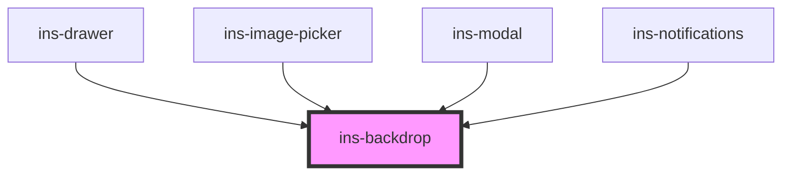

# ins-backdrop

<!-- Auto Generated Below -->

## Properties

| Property | Attribute | Description | Type      | Default |
| -------- | --------- | ----------- | --------- | ------- |
| `light`  | `light`   |             | `boolean` | `false` |

## Dependencies

### Used by

 - [ins-drawer](../ins-drawer)
 - [ins-image-picker](../ins-image-picker)
 - [ins-modal](../ins-modal)
 - [ins-notifications](../ins-notifications)

### Graph

----------------------------------------------

*Built with [StencilJS](https://stenciljs.com/)*
