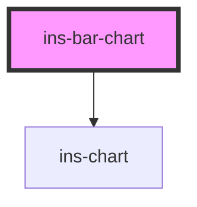

# ins-bar-chart

<!-- Auto Generated Below -->

## Properties

| Property     | Attribute    | Description | Type      | Default     |
| ------------ | ------------ | ----------- | --------- | ----------- |
| `categories` | --           |             | `any[]`   | `[]`        |
| `chartData`  | --           |             | `any[]`   | `[]`        |
| `hasLoad`    | `has-load`   |             | `string`  | `undefined` |
| `horizontal` | `horizontal` |             | `boolean` | `false`     |
| `name`       | `name`       |             | `string`  | `""`        |
| `stacked`    | `stacked`    |             | `boolean` | `false`     |

## Events

| Event     | Description | Type               |
| --------- | ----------- | ------------------ |
| `didLoad` |             | `CustomEvent<any>` |

## Dependencies

### Depends on

- [ins-chart](../ins-chart)

### Graph

----------------------------------------------

*Built with [StencilJS](https://stenciljs.com/)*
