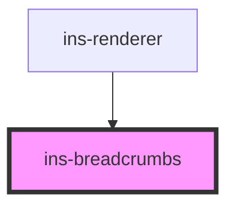

# ins-breadcrumbs

<!-- Auto Generated Below -->

## Properties

| Property      | Attribute | Description | Type    | Default |
| ------------- | --------- | ----------- | ------- | ------- |
| `breadcrumbs` | --        |             | `any[]` | `[]`    |

## Events

| Event       | Description | Type               |
| ----------- | ----------- | ------------------ |
| `routePage` |             | `CustomEvent<any>` |

## Methods

### `updateCrumbs(crumbs: any, noRedirect?: boolean) => Promise<void>`

#### Returns

Type: `Promise<void>`

## Dependencies

### Used by

 - [ins-renderer](../ins-renderer)

### Graph

----------------------------------------------

*Built with [StencilJS](https://stenciljs.com/)*
