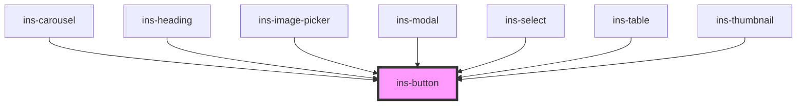

# ins-button

<!-- Auto Generated Below -->

## Properties

| Property        | Attribute        | Description | Type      | Default     |
| --------------- | ---------------- | ----------- | --------- | ----------- |
| `color`         | `color`          |             | `string`  | `'blue'`    |
| `cursor`        | `cursor`         |             | `string`  | `''`        |
| `data`          | `data`           |             | `string`  | `''`        |
| `disabled`      | `disabled`       |             | `boolean` | `false`     |
| `dropdown`      | `dropdown`       |             | `boolean` | `false`     |
| `hasLoad`       | `has-load`       |             | `string`  | `undefined` |
| `icon`          | `icon`           |             | `string`  | `''`        |
| `label`         | `label`          |             | `string`  | `'BUTTON'`  |
| `loading`       | `loading`        |             | `boolean` | `false`     |
| `options`       | `options`        |             | `string`  | `''`        |
| `outlined`      | `outlined`       |             | `boolean` | `false`     |
| `size`          | `size`           |             | `string`  | `'normal'`  |
| `solid`         | `solid`          |             | `boolean` | `false`     |
| `textTransform` | `text-transform` |             | `string`  | `''`        |
| `type`          | `type`           |             | `string`  | `''`        |

## Events

| Event            | Description | Type               |
| ---------------- | ----------- | ------------------ |
| `didLoad`        |             | `CustomEvent<any>` |
| `insClick`       |             | `CustomEvent<any>` |
| `insClickOption` |             | `CustomEvent<any>` |

## Dependencies

### Used by

 - [ins-carousel](../ins-carousel)
 - [ins-heading](../ins-heading)
 - [ins-image-picker](../ins-image-picker)
 - [ins-modal](../ins-modal)
 - [ins-select](../ins-select)
 - [ins-table](../ins-table)
 - [ins-thumbnail](../ins-thumbnail)

### Graph

----------------------------------------------

*Built with [StencilJS](https://stenciljs.com/)*
