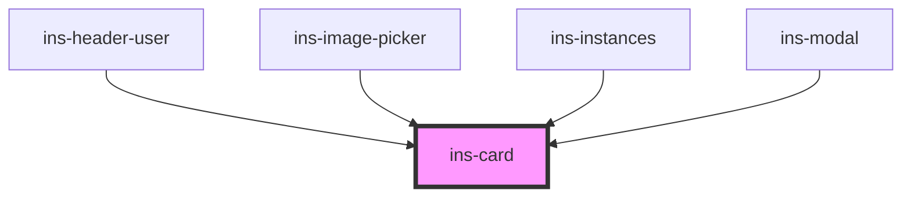

# ins-card

<!-- Auto Generated Below -->

## Properties

| Property    | Attribute    | Description | Type      | Default     |
| ----------- | ------------ | ----------- | --------- | ----------- |
| `noPadding` | `no-padding` |             | `boolean` | `undefined` |
| `outlined`  | `outlined`   |             | `boolean` | `undefined` |
| `steady`    | `steady`     |             | `boolean` | `undefined` |

## Dependencies

### Used by

 - [ins-header-user](../ins-header-user)
 - [ins-image-picker](../ins-image-picker)
 - [ins-instances](../ins-instances)
 - [ins-modal](../ins-modal)

### Graph

----------------------------------------------

*Built with [StencilJS](https://stenciljs.com/)*
