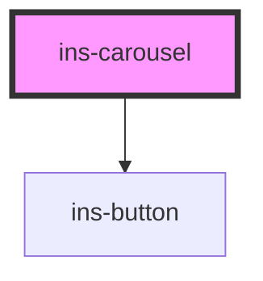

# ins-carousel

<!-- Auto Generated Below -->

## Properties

| Property           | Attribute            | Description | Type      | Default     |
| ------------------ | -------------------- | ----------- | --------- | ----------- |
| `autoplay`         | `autoplay`           |             | `boolean` | `false`     |
| `autostop`         | `autostop`           |             | `boolean` | `false`     |
| `bindTo`           | `bind-to`            |             | `string`  | `""`        |
| `bodyText`         | `body-text`          |             | `string`  | `""`        |
| `ctaColor`         | `cta-color`          |             | `string`  | `"blue"`    |
| `ctaDisabled`      | `cta-disabled`       |             | `boolean` | `false`     |
| `ctaLabel`         | `cta-label`          |             | `string`  | `""`        |
| `ctaLink`          | `cta-link`           |             | `string`  | `""`        |
| `ctaLinkTarget`    | `cta-link-target`    |             | `string`  | `"_blank"`  |
| `dragDisabled`     | `drag-disabled`      |             | `boolean` | `false`     |
| `duration`         | `duration`           |             | `number`  | `3000`      |
| `hasLoad`          | `has-load`           |             | `string`  | `undefined` |
| `heading`          | `heading`            |             | `string`  | `""`        |
| `height`           | `height`             |             | `string`  | `"auto"`    |
| `layout`           | `layout`             |             | `number`  | `1`         |
| `loop`             | `loop`               |             | `boolean` | `false`     |
| `noCarouselButton` | `no-carousel-button` |             | `boolean` | `false`     |
| `noPagination`     | `no-pagination`      |             | `boolean` | `false`     |
| `perPage`          | `per-page`           |             | `number`  | `1`         |
| `startIndex`       | `start-index`        |             | `number`  | `0`         |
| `subHeading`       | `sub-heading`        |             | `string`  | `""`        |
| `transition`       | `transition`         |             | `number`  | `350`       |
| `width`            | `width`              |             | `string`  | `"100%"`    |

## Events

| Event      | Description | Type               |
| ---------- | ----------- | ------------------ |
| `didLoad`  |             | `CustomEvent<any>` |
| `insSlide` |             | `CustomEvent<any>` |

## Methods

### `goTo(slide: any) => Promise<void>`

#### Returns

Type: `Promise<void>`

## Dependencies

### Depends on

- [ins-button](../ins-button)

### Graph

----------------------------------------------

*Built with [StencilJS](https://stenciljs.com/)*
