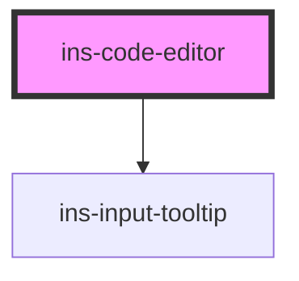

# ins-code-editor

<!-- Auto Generated Below -->

## Properties

| Property             | Attribute              | Description | Type      | Default       |
| -------------------- | ---------------------- | ----------- | --------- | ------------- |
| `autoHeight`         | `auto-height`          |             | `boolean` | `false`       |
| `checkLoad`          | `check-load`           |             | `boolean` | `false`       |
| `checkValue`         | `check-value`          |             | `boolean` | `false`       |
| `description`        | `description`          |             | `string`  | `""`          |
| `disableLineNumbers` | `disable-line-numbers` |             | `boolean` | `false`       |
| `errorMessage`       | `error-message`        |             | `string`  | `""`          |
| `hasError`           | `has-error`            |             | `boolean` | `false`       |
| `hasLoad`            | `has-load`             |             | `string`  | `undefined`   |
| `htmlDescription`    | `html-description`     |             | `boolean` | `false`       |
| `label`              | `label`                |             | `string`  | `""`          |
| `load`               | `load`                 |             | `boolean` | `false`       |
| `mode`               | `mode`                 |             | `string`  | `"htmlmixed"` |
| `name`               | `name`                 |             | `string`  | `""`          |
| `readonly`           | `readonly`             |             | `boolean` | `false`       |
| `theme`              | `theme`                |             | `string`  | `""`          |
| `tooltip`            | `tooltip`              |             | `string`  | `""`          |
| `value`              | `value`                |             | `string`  | `""`          |

## Events

| Event            | Description | Type               |
| ---------------- | ----------- | ------------------ |
| `didLoad`        |             | `CustomEvent<any>` |
| `insBlur`        |             | `CustomEvent<any>` |
| `insInput`       |             | `CustomEvent<any>` |
| `insValueChange` |             | `CustomEvent<any>` |

## Methods

### `beautify() => Promise<void>`

#### Returns

Type: `Promise<void>`

### `getValue() => Promise<any>`

#### Returns

Type: `Promise<any>`

### `insRecover() => Promise<void>`

#### Returns

Type: `Promise<void>`

### `insReset() => Promise<void>`

#### Returns

Type: `Promise<void>`

### `refresh() => Promise<void>`

#### Returns

Type: `Promise<void>`

### `reset() => Promise<void>`

#### Returns

Type: `Promise<void>`

### `setValue(value: any) => Promise<void>`

#### Parameters

| Name    | Type  | Description |
| ------- | ----- | ----------- |
| `value` | `any` |             |

#### Returns

Type: `Promise<void>`

### `val() => Promise<any>`

#### Returns

Type: `Promise<any>`

## Dependencies

### Depends on

- [ins-input-tooltip](../ins-input-tooltip)

### Graph

----------------------------------------------

*Built with [StencilJS](https://stenciljs.com/)*
