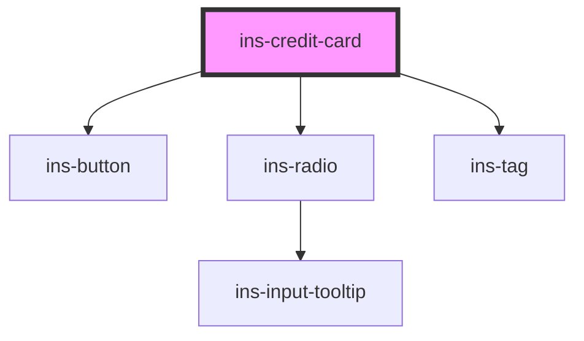

# ins-credit-card

<!-- Auto Generated Below -->

## Properties

| Property             | Attribute              | Description | Type      | Default                |
| -------------------- | ---------------------- | ----------- | --------- | ---------------------- |
| `active`             | `active`               |             | `boolean` | `undefined`            |
| `brand`              | `brand`                |             | `string`  | `undefined`            |
| `checkLoad`          | `check-load`           |             | `boolean` | `false`                |
| `compact`            | `compact`              |             | `boolean` | `undefined`            |
| `expired`            | `expired`              |             | `boolean` | `undefined`            |
| `expiredLabel`       | `expired-label`        |             | `string`  | `"Expired"`            |
| `expiryMonth`        | `expiry-month`         |             | `string`  | `undefined`            |
| `expiryYear`         | `expiry-year`          |             | `string`  | `undefined`            |
| `fullYear`           | `full-year`            |             | `boolean` | `undefined`            |
| `hasLoad`            | `has-load`             |             | `string`  | `undefined`            |
| `label`              | `label`                |             | `string`  | `undefined`            |
| `lastFour`           | `last-four`            |             | `string`  | `undefined`            |
| `load`               | `load`                 |             | `boolean` | `false`                |
| `options`            | `options`              |             | `string`  | `''`                   |
| `optionsColor`       | `options-color`        |             | `string`  | `'grey'`               |
| `optionsIcon`        | `options-icon`         |             | `string`  | `'icon-more-vertical'` |
| `tag`                | `tag`                  |             | `string`  | `undefined`            |
| `tagBackgroundColor` | `tag-background-color` |             | `string`  | `undefined`            |
| `tagColor`           | `tag-color`            |             | `string`  | `undefined`            |
| `tagFontColor`       | `tag-font-color`       |             | `string`  | `undefined`            |
| `tagIcon`            | `tag-icon`             |             | `string`  | `undefined`            |
| `tagLight`           | `tag-light`            |             | `boolean` | `false`                |
| `tagOutlined`        | `tag-outlined`         |             | `boolean` | `false`                |
| `value`              | `value`                |             | `string`  | `undefined`            |

## Events

| Event            | Description | Type               |
| ---------------- | ----------- | ------------------ |
| `didLoad`        |             | `CustomEvent<any>` |
| `insClick`       |             | `CustomEvent<any>` |
| `insClose`       |             | `CustomEvent<any>` |
| `insOption`      |             | `CustomEvent<any>` |
| `insValueChange` |             | `CustomEvent<any>` |

## Methods

### `getValue() => Promise<string>`

#### Returns

Type: `Promise<string>`

### `setValue(value: any) => Promise<void>`

#### Parameters

| Name    | Type  | Description |
| ------- | ----- | ----------- |
| `value` | `any` |             |

#### Returns

Type: `Promise<void>`

## Dependencies

### Depends on

- [ins-button](../ins-button)
- [ins-radio](../ins-radio)
- [ins-tag](../ins-tag)

### Graph

----------------------------------------------

*Built with [StencilJS](https://stenciljs.com/)*
