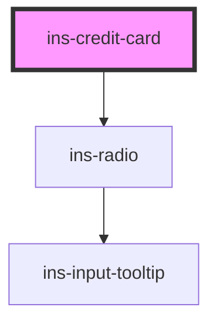

# ins-credit-card

<!-- Auto Generated Below -->

## Properties

| Property      | Attribute      | Description | Type      | Default     |
| ------------- | -------------- | ----------- | --------- | ----------- |
| `active`      | `active`       |             | `boolean` | `undefined` |
| `brand`       | `brand`        |             | `string`  | `undefined` |
| `checkLoad`   | `check-load`   |             | `boolean` | `false`     |
| `compact`     | `compact`      |             | `boolean` | `undefined` |
| `expired`     | `expired`      |             | `boolean` | `undefined` |
| `expiryMonth` | `expiry-month` |             | `string`  | `undefined` |
| `expiryYear`  | `expiry-year`  |             | `string`  | `undefined` |
| `fullYear`    | `full-year`    |             | `boolean` | `undefined` |
| `hasLoad`     | `has-load`     |             | `string`  | `undefined` |
| `lastFour`    | `last-four`    |             | `string`  | `undefined` |
| `load`        | `load`         |             | `boolean` | `false`     |
| `value`       | `value`        |             | `string`  | `undefined` |

## Events

| Event            | Description | Type               |
| ---------------- | ----------- | ------------------ |
| `didLoad`        |             | `CustomEvent<any>` |
| `insClick`       |             | `CustomEvent<any>` |
| `insClose`       |             | `CustomEvent<any>` |
| `insValueChange` |             | `CustomEvent<any>` |

## Methods

### `getValue() => Promise<string>`

#### Returns

Type: `Promise<string>`

### `setValue(value: any) => Promise<void>`

#### Parameters

| Name    | Type  | Description |
| ------- | ----- | ----------- |
| `value` | `any` |             |

#### Returns

Type: `Promise<void>`

## Dependencies

### Depends on

- [ins-radio](../ins-radio)

### Graph

----------------------------------------------

*Built with [StencilJS](https://stenciljs.com/)*
