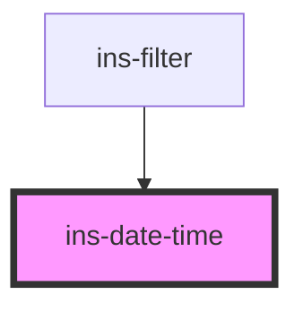

# ins-date-time

<!-- Auto Generated Below -->

## Properties

| Property       | Attribute       | Description | Type      | Default     |
| -------------- | --------------- | ----------- | --------- | ----------- |
| `disabled`     | `disabled`      |             | `boolean` | `false`     |
| `errorMessage` | `error-message` |             | `string`  | `""`        |
| `format`       | `format`        |             | `string`  | `undefined` |
| `hasError`     | `has-error`     |             | `boolean` | `false`     |
| `hasLoad`      | `has-load`      |             | `string`  | `undefined` |
| `icon`         | `icon`          |             | `string`  | `""`        |
| `inline`       | `inline`        |             | `boolean` | `false`     |
| `label`        | `label`         |             | `string`  | `undefined` |
| `maxDate`      | `max-date`      |             | `string`  | `""`        |
| `maxTime`      | `max-time`      |             | `string`  | `""`        |
| `minDate`      | `min-date`      |             | `string`  | `""`        |
| `minTime`      | `min-time`      |             | `string`  | `""`        |
| `mode`         | `mode`          |             | `string`  | `""`        |
| `name`         | `name`          |             | `string`  | `undefined` |
| `noMeridiem`   | `no-meridiem`   |             | `boolean` | `false`     |
| `placeholder`  | `placeholder`   |             | `string`  | `""`        |
| `readonly`     | `readonly`      |             | `boolean` | `false`     |
| `value`        | `value`         |             | `string`  | `""`        |

## Events

| Event            | Description | Type               |
| ---------------- | ----------- | ------------------ |
| `didLoad`        |             | `CustomEvent<any>` |
| `insInput`       |             | `CustomEvent<any>` |
| `insValueChange` |             | `CustomEvent<any>` |

## Methods

### `formatDate(date: any) => Promise<any>`

#### Returns

Type: `Promise<any>`

## Dependencies

### Used by

 - [ins-filter](../ins-filter)

### Graph

----------------------------------------------

*Built with [StencilJS](https://stenciljs.com/)*
