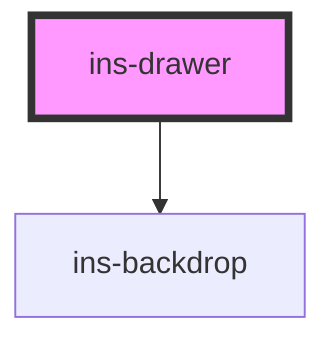

# ins-drawer

<!-- Auto Generated Below -->

## Properties

| Property           | Attribute            | Description | Type      | Default     |
| ------------------ | -------------------- | ----------- | --------- | ----------- |
| `backdropCanClose` | `backdrop-can-close` |             | `boolean` | `true`      |
| `bordered`         | `bordered`           |             | `boolean` | `true`      |
| `customWidth`      | `custom-width`       |             | `string`  | `undefined` |
| `hasLoad`          | `has-load`           |             | `string`  | `undefined` |
| `icon`             | `icon`               |             | `string`  | `undefined` |
| `isOpen`           | `is-open`            |             | `boolean` | `false`     |
| `label`            | `label`              |             | `string`  | `undefined` |
| `noPadding`        | `no-padding`         |             | `boolean` | `false`     |
| `position`         | `position`           |             | `string`  | `""`        |
| `showCloseButton`  | `show-close-button`  |             | `boolean` | `true`      |
| `showHeader`       | `show-header`        |             | `boolean` | `true`      |
| `stickyHeader`     | `sticky-header`      |             | `boolean` | `true`      |

## Events

| Event       | Description | Type               |
| ----------- | ----------- | ------------------ |
| `didLoad`   |             | `CustomEvent<any>` |
| `insToggle` |             | `CustomEvent<any>` |

## Methods

### `setDrawerState(status: any) => Promise<void>`

#### Returns

Type: `Promise<void>`

## Dependencies

### Depends on

- [ins-backdrop](../ins-backdrop)

### Graph

----------------------------------------------

*Built with [StencilJS](https://stenciljs.com/)*
