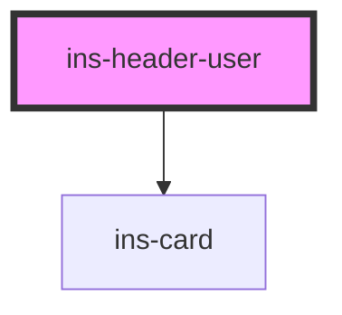

# ins-header-user

<!-- Auto Generated Below -->

## Properties

| Property         | Attribute         | Description | Type      | Default          |
| ---------------- | ----------------- | ----------- | --------- | ---------------- |
| `app`            | `app`             |             | `boolean` | `undefined`      |
| `formattedRoute` | `formatted-route` |             | `string`  | `undefined`      |
| `logoutLabel`    | `logout-label`    |             | `string`  | `'Logout'`       |
| `logoutLink`     | `logout-link`     |             | `string`  | `''`             |
| `name`           | `name`            |             | `string`  | `'User'`         |
| `profileLabel`   | `profile-label`   |             | `string`  | `'My Profile'`   |
| `profileLink`    | `profile-link`    |             | `string`  | `'#/my-profile'` |

## Events

| Event       | Description | Type               |
| ----------- | ----------- | ------------------ |
| `routePage` |             | `CustomEvent<any>` |

## Methods

### `renderMyProfile() => Promise<void>`

#### Returns

Type: `Promise<void>`

### `routePageHandler() => Promise<void>`

#### Returns

Type: `Promise<void>`

## Dependencies

### Depends on

- [ins-card](../ins-card)

### Graph

----------------------------------------------

*Built with [StencilJS](https://stenciljs.com/)*
