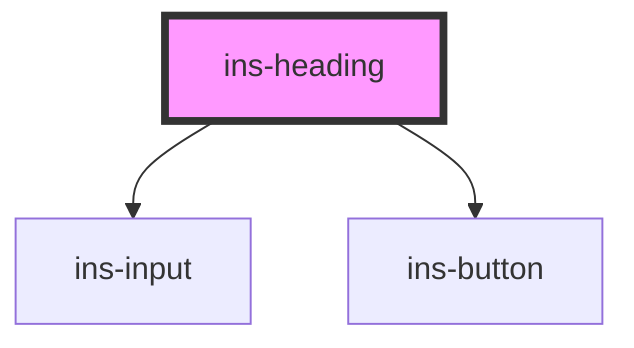

# ins-heading

<!-- Auto Generated Below -->

## Properties

| Property          | Attribute          | Description | Type      | Default  |
| ----------------- | ------------------ | ----------- | --------- | -------- |
| `backgroundColor` | `background-color` |             | `string`  | `'#fff'` |
| `change`          | `change`           |             | `string`  | `""`     |
| `editable`        | `editable`         |             | `boolean` | `false`  |
| `label`           | `label`            |             | `string`  | `""`     |
| `level`           | `level`            |             | `number`  | `6`      |
| `maxlength`       | `maxlength`        |             | `string`  | `""`     |
| `name`            | `name`             |             | `string`  | `""`     |
| `withoutLine`     | `without-line`     |             | `boolean` | `false`  |

## Events

| Event       | Description | Type               |
| ----------- | ----------- | ------------------ |
| `insChange` |             | `CustomEvent<any>` |

## Dependencies

### Depends on

- [ins-input](../ins-input)
- [ins-button](../ins-button)

### Graph

----------------------------------------------

*Built with [StencilJS](https://stenciljs.com/)*
