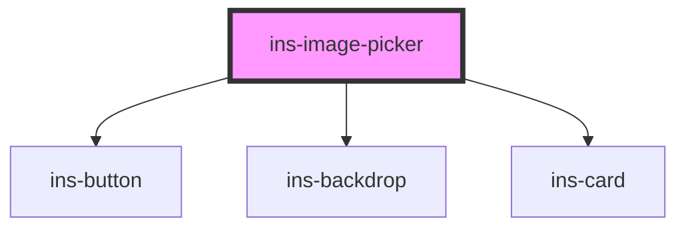

# ins-image-picker

<!-- Auto Generated Below -->

## Properties

| Property               | Attribute                  | Description | Type      | Default                                    |
| ---------------------- | -------------------------- | ----------- | --------- | ------------------------------------------ |
| `buttonColor`          | `button-color`             |             | `string`  | `'blue'`                                   |
| `fileName`             | `file-name`                |             | `any`     | `undefined`                                |
| `imgType`              | `img-type`                 |             | `string`  | `'picture'`                                |
| `label`                | `label`                    |             | `string`  | `'CHANGE PICTURE'`                         |
| `name`                 | `name`                     |             | `string`  | `undefined`                                |
| `notImageFile`         | `not-image-file`           |             | `boolean` | `undefined`                                |
| `placeholder`          | `placeholder`              |             | `string`  | `'Drag and drop the file or add an image'` |
| `uploadImgContainer`   | `upload-img-container`     |             | `string`  | `""`                                       |
| `uploadImgRecFileSize` | `upload-img-rec-file-size` |             | `number`  | `25`                                       |
| `uploadImgRecHeight`   | `upload-img-rec-height`    |             | `number`  | `120`                                      |
| `uploadImgRecWidth`    | `upload-img-rec-width`     |             | `number`  | `120`                                      |
| `value`                | `value`                    |             | `any`     | `undefined`                                |

## Events

| Event            | Description | Type               |
| ---------------- | ----------- | ------------------ |
| `insValueChange` |             | `CustomEvent<any>` |

## Dependencies

### Depends on

- [ins-button](../ins-button)
- [ins-backdrop](../ins-backdrop)
- [ins-card](../ins-card)

### Graph

----------------------------------------------

*Built with [StencilJS](https://stenciljs.com/)*
