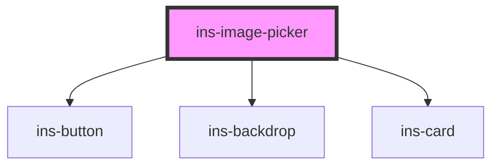

# ins-image-picker

<!-- Auto Generated Below -->

## Properties

| Property                   | Attribute                       | Description | Type      | Default                                    |
| -------------------------- | ------------------------------- | ----------- | --------- | ------------------------------------------ |
| `buttonColor`              | `button-color`                  |             | `string`  | `'blue'`                                   |
| `errorMessage`             | `error-message`                 |             | `string`  | `"Invalid image file."`                    |
| `fileName`                 | `file-name`                     |             | `any`     | `undefined`                                |
| `hasLoad`                  | `has-load`                      |             | `string`  | `undefined`                                |
| `imgType`                  | `img-type`                      |             | `string`  | `'picture'`                                |
| `label`                    | `label`                         |             | `string`  | `'CHANGE PICTURE'`                         |
| `name`                     | `name`                          |             | `string`  | `undefined`                                |
| `notImageFile`             | `not-image-file`                |             | `boolean` | `undefined`                                |
| `placeholder`              | `placeholder`                   |             | `string`  | `'Drag and drop the file or add an image'` |
| `uploadImgContainer`       | `upload-img-container`          |             | `string`  | `""`                                       |
| `uploadImgFileFormats`     | `upload-img-file-formats`       |             | `string`  | `"JPG, JPEG, PNG or SVG."`                 |
| `uploadImgRecFileSize`     | `upload-img-rec-file-size`      |             | `number`  | `25`                                       |
| `uploadImgRecFileSizeType` | `upload-img-rec-file-size-type` |             | `string`  | `"KB"`                                     |
| `uploadImgRecHeight`       | `upload-img-rec-height`         |             | `number`  | `120`                                      |
| `uploadImgRecWidth`        | `upload-img-rec-width`          |             | `number`  | `120`                                      |
| `value`                    | `value`                         |             | `any`     | `undefined`                                |

## Events

| Event            | Description | Type               |
| ---------------- | ----------- | ------------------ |
| `didLoad`        |             | `CustomEvent<any>` |
| `insValueChange` |             | `CustomEvent<any>` |

## Methods

### `getValue() => Promise<any>`

#### Returns

Type: `Promise<any>`

### `setValue(value: any, file_name: any) => Promise<void>`

#### Parameters

| Name        | Type  | Description |
| ----------- | ----- | ----------- |
| `value`     | `any` |             |
| `file_name` | `any` |             |

#### Returns

Type: `Promise<void>`

## Dependencies

### Depends on

- [ins-button](../ins-button)
- [ins-backdrop](../ins-backdrop)
- [ins-card](../ins-card)

### Graph

----------------------------------------------

*Built with [StencilJS](https://stenciljs.com/)*
