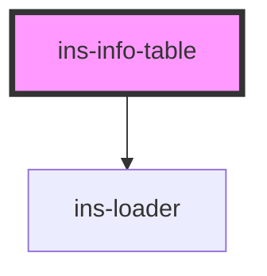

# ins-info-table

<!-- Auto Generated Below -->

## Properties

| Property        | Attribute        | Description | Type      | Default                            |
| --------------- | ---------------- | ----------- | --------- | ---------------------------------- |
| `checkLoad`     | `check-load`     |             | `boolean` | `false`                            |
| `emptyValue`    | `empty-value`    |             | `string`  | `'-'`                              |
| `hasLoad`       | `has-load`       |             | `string`  | `undefined`                        |
| `heading`       | `heading`        |             | `string`  | `undefined`                        |
| `load`          | `load`           |             | `boolean` | `false`                            |
| `loaderIcon`    | `loader-icon`    |             | `any`     | `"processing"`                     |
| `loaderMessage` | `loader-message` |             | `any`     | `"We are processing your request"` |
| `loaderTitle`   | `loader-title`   |             | `any`     | `"Just a moment"`                  |
| `loadingScreen` | `loading-screen` |             | `boolean` | `false`                            |
| `noWrap`        | `no-wrap`        |             | `boolean` | `false`                            |
| `renderHtml`    | `render-html`    |             | `boolean` | `false`                            |
| `tableData`     | `table-data`     |             | `any`     | `[]`                               |
| `textOverflow`  | `text-overflow`  |             | `string`  | `'ellipsis'`                       |

## Events

| Event     | Description | Type               |
| --------- | ----------- | ------------------ |
| `didLoad` |             | `CustomEvent<any>` |

## Dependencies

### Depends on

- [ins-loader](../ins-loader)

### Graph

----------------------------------------------

*Built with [StencilJS](https://stenciljs.com/)*
