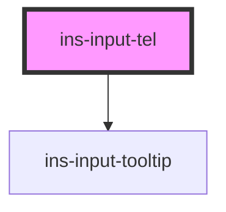

# ins-input-tel

<!-- Auto Generated Below -->

## Properties

| Property              | Attribute              | Description | Type      | Default     |
| --------------------- | ---------------------- | ----------- | --------- | ----------- |
| `areaCode`            | `area-code`            |             | `string`  | `""`        |
| `areacodePlaceholder` | `areacode-placeholder` |             | `string`  | `""`        |
| `areacodeValue`       | `areacode-value`       |             | `string`  | `""`        |
| `countryCode`         | `country-code`         |             | `string`  | `"61"`      |
| `disabled`            | `disabled`             |             | `boolean` | `undefined` |
| `errorMessage`        | `error-message`        |             | `string`  | `""`        |
| `hasError`            | `has-error`            |             | `boolean` | `undefined` |
| `hasLoad`             | `has-load`             |             | `string`  | `undefined` |
| `label`               | `label`                |             | `string`  | `""`        |
| `noAreacode`          | `no-areacode`          |             | `boolean` | `undefined` |
| `phoneNumber`         | `phone-number`         |             | `string`  | `""`        |
| `phonenumPlaceholder` | `phonenum-placeholder` |             | `string`  | `""`        |
| `phonenumValue`       | `phonenum-value`       |             | `string`  | `""`        |
| `readonly`            | `readonly`             |             | `boolean` | `undefined` |
| `required`            | `required`             |             | `boolean` | `undefined` |
| `tooltip`             | `tooltip`              |             | `string`  | `""`        |

## Events

| Event            | Description | Type               |
| ---------------- | ----------- | ------------------ |
| `didLoad`        |             | `CustomEvent<any>` |
| `insInput`       |             | `CustomEvent<any>` |
| `insValueChange` |             | `CustomEvent<any>` |

## Methods

### `getCountryData() => Promise<any>`

#### Returns

Type: `Promise<any>`

### `getValue() => Promise<string>`

#### Returns

Type: `Promise<string>`

### `getValues() => Promise<{ country_code: any; area_code: any; phone_number: any; }>`

#### Returns

Type: `Promise<{ country_code: any; area_code: any; phone_number: any; }>`

### `setCountry(country: any) => Promise<void>`

#### Returns

Type: `Promise<void>`

### `setCountryCode(code: any) => Promise<void>`

#### Returns

Type: `Promise<void>`

## Dependencies

### Depends on

- [ins-input-tooltip](../ins-input-tooltip)

### Graph

----------------------------------------------

*Built with [StencilJS](https://stenciljs.com/)*
