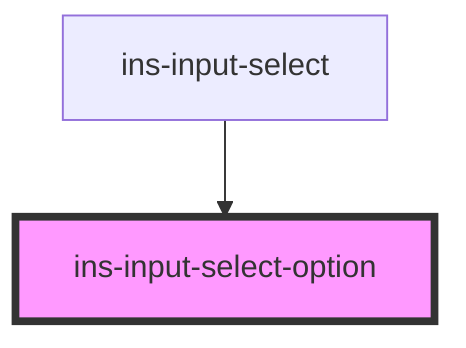

# ins-input-select-option

<!-- Auto Generated Below -->

## Properties

| Property    | Attribute   | Description | Type      | Default    |
| ----------- | ----------- | ----------- | --------- | ---------- |
| `activated` | `activated` |             | `boolean` | `false`    |
| `default`   | `default`   |             | `boolean` | `false`    |
| `disabled`  | `disabled`  |             | `boolean` | `false`    |
| `hidden`    | `hidden`    |             | `boolean` | `false`    |
| `label`     | `label`     |             | `string`  | `'Option'` |
| `value`     | `value`     |             | `string`  | `''`       |

## Events

| Event                         | Description | Type               |
| ----------------------------- | ----------- | ------------------ |
| `insInputSelectOptionClicked` |             | `CustomEvent<any>` |

## Methods

### `activate() => Promise<void>`

#### Returns

Type: `Promise<void>`

### `deactivate() => Promise<void>`

#### Returns

Type: `Promise<void>`

### `hideOption() => Promise<void>`

#### Returns

Type: `Promise<void>`

### `showOption() => Promise<void>`

#### Returns

Type: `Promise<void>`

## Dependencies

### Used by

 - [ins-input-select](../ins-input-select)

### Graph

----------------------------------------------

*Built with [StencilJS](https://stenciljs.com/)*
