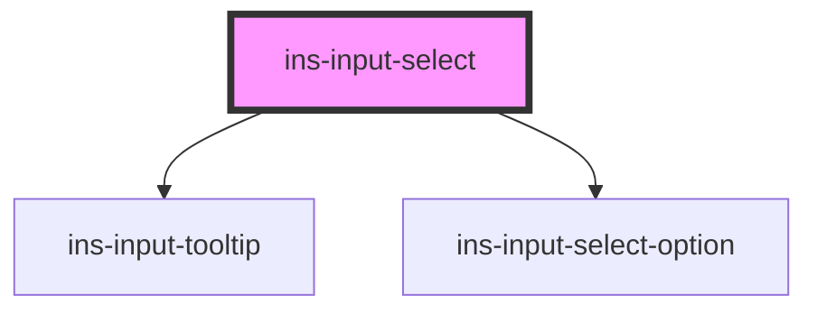

# ins-input-select

<!-- Auto Generated Below -->

## Properties

| Property                | Attribute                | Description | Type      | Default                             |
| ----------------------- | ------------------------ | ----------- | --------- | ----------------------------------- |
| `blankLabel`            | `blank-label`            |             | `boolean` | `false`                             |
| `disabled`              | `disabled`               |             | `boolean` | `false`                             |
| `dropUp`                | `drop-up`                |             | `boolean` | `false`                             |
| `dynamicButtonLabel`    | `dynamic-button-label`   |             | `string`  | `"Add"`                             |
| `dynamicErrorMessage`   | `dynamic-error-message`  |             | `string`  | `""`                                |
| `dynamicHasError`       | `dynamic-has-error`      |             | `boolean` | `false`                             |
| `dynamicOption`         | `dynamic-option`         |             | `boolean` | `false`                             |
| `dynamicPlaceholder`    | `dynamic-placeholder`    |             | `string`  | `undefined`                         |
| `dynamicValue`          | `dynamic-value`          |             | `string`  | `""`                                |
| `errorMessage`          | `error-message`          |             | `string`  | `""`                                |
| `hasError`              | `has-error`              |             | `boolean` | `false`                             |
| `hasLoad`               | `has-load`               |             | `string`  | `undefined`                         |
| `label`                 | `label`                  |             | `string`  | `undefined`                         |
| `labelKey`              | `label-key`              |             | `string`  | `""`                                |
| `lookup`                | `lookup`                 |             | `boolean` | `false`                             |
| `lookupLoading`         | `lookup-loading`         |             | `boolean` | `false`                             |
| `lookupScrolling`       | `lookup-scrolling`       |             | `boolean` | `false`                             |
| `multiple`              | `multiple`               |             | `boolean` | `false`                             |
| `name`                  | `name`                   |             | `string`  | `undefined`                         |
| `optionsData`           | --                       |             | `any[]`   | `[]`                                |
| `placeholder`           | `placeholder`            |             | `string`  | `""`                                |
| `readonly`              | `readonly`               |             | `boolean` | `false`                             |
| `searchable`            | `searchable`             |             | `boolean` | `false`                             |
| `searchablePlaceholder` | `searchable-placeholder` |             | `string`  | `"Type here to search for options"` |
| `selectedValues`        | `selected-values`        |             | `any`     | `[]`                                |
| `tooltip`               | `tooltip`                |             | `string`  | `""`                                |
| `value`                 | `value`                  |             | `any`     | `undefined`                         |
| `valueKey`              | `value-key`              |             | `string`  | `""`                                |

## Events

| Event              | Description | Type               |
| ------------------ | ----------- | ------------------ |
| `didLoad`          |             | `CustomEvent<any>` |
| `insChange`        |             | `CustomEvent<any>` |
| `insDynamicSubmit` |             | `CustomEvent<any>` |
| `insLoadMore`      |             | `CustomEvent<any>` |
| `insOptionSelect`  |             | `CustomEvent<any>` |
| `insSearch`        |             | `CustomEvent<any>` |

## Methods

### `closeOptions() => Promise<void>`

#### Returns

Type: `Promise<void>`

### `disableNoResult() => Promise<boolean>`

#### Returns

Type: `Promise<boolean>`

### `dynamicCloseOptions() => Promise<void>`

#### Returns

Type: `Promise<void>`

### `dynamicUpdateOptions() => Promise<void>`

#### Returns

Type: `Promise<void>`

### `enableNoResult() => Promise<boolean>`

#### Returns

Type: `Promise<boolean>`

### `getAllOptions() => Promise<NodeListOf<HTMLInsInputSelectOptionElement>>`

#### Returns

Type: `Promise<NodeListOf<HTMLInsInputSelectOptionElement>>`

### `getValue() => Promise<any>`

#### Returns

Type: `Promise<any>`

### `resetValue() => Promise<void>`

#### Returns

Type: `Promise<void>`

### `setLoadingState(state: any) => Promise<boolean>`

#### Returns

Type: `Promise<boolean>`

### `setSearchingState(state: any) => Promise<boolean>`

#### Returns

Type: `Promise<boolean>`

### `setValue(value?: any) => Promise<boolean>`

#### Returns

Type: `Promise<boolean>`

## Dependencies

### Depends on

- [ins-input-tooltip](../ins-input-tooltip)
- [ins-input-select-option](../ins-input-select-option)

### Graph

----------------------------------------------

*Built with [StencilJS](https://stenciljs.com/)*
