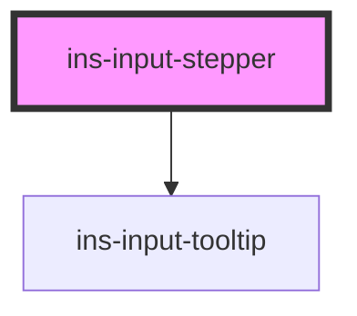

# ins-stepper

<!-- Auto Generated Below -->

## Properties

| Property       | Attribute       | Description | Type      | Default     |
| -------------- | --------------- | ----------- | --------- | ----------- |
| `disabled`     | `disabled`      |             | `boolean` | `false`     |
| `errorMessage` | `error-message` |             | `string`  | `""`        |
| `hasError`     | `has-error`     |             | `boolean` | `false`     |
| `hasLoad`      | `has-load`      |             | `string`  | `undefined` |
| `label`        | `label`         |             | `string`  | `""`        |
| `max`          | `max`           |             | `string`  | `undefined` |
| `min`          | `min`           |             | `string`  | `undefined` |
| `name`         | `name`          |             | `string`  | `""`        |
| `readonly`     | `readonly`      |             | `boolean` | `false`     |
| `required`     | `required`      |             | `boolean` | `false`     |
| `step`         | `step`          |             | `string`  | `"1"`       |
| `tooltip`      | `tooltip`       |             | `string`  | `""`        |
| `value`        | `value`         |             | `string`  | `undefined` |

## Events

| Event            | Description | Type               |
| ---------------- | ----------- | ------------------ |
| `didLoad`        |             | `CustomEvent<any>` |
| `insBlur`        |             | `CustomEvent<any>` |
| `insValueChange` |             | `CustomEvent<any>` |

## Methods

### `getValue() => Promise<string>`

#### Returns

Type: `Promise<string>`

### `setValue(value: any) => Promise<void>`

#### Returns

Type: `Promise<void>`

## Dependencies

### Depends on

- [ins-input-tooltip](../ins-input-tooltip)

### Graph

----------------------------------------------

*Built with [StencilJS](https://stenciljs.com/)*
