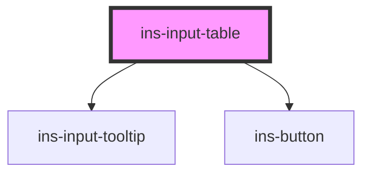

# ins-input-table

<!-- Auto Generated Below -->

## Properties

| Property            | Attribute             | Description | Type      | Default        |
| ------------------- | --------------------- | ----------- | --------- | -------------- |
| `addButtonColor`    | `add-button-color`    |             | `string`  | `"blue"`       |
| `addButtonIcon`     | `add-button-icon`     |             | `string`  | `"icon-plus"`  |
| `blankValues`       | `blank-values`        |             | `boolean` | `undefined`    |
| `checkLoad`         | `check-load`          |             | `boolean` | `false`        |
| `checkValue`        | `check-value`         |             | `boolean` | `false`        |
| `description`       | `description`         |             | `string`  | `""`           |
| `disabled`          | `disabled`            |             | `boolean` | `undefined`    |
| `errorMessage`      | `error-message`       |             | `string`  | `undefined`    |
| `hasError`          | `has-error`           |             | `boolean` | `undefined`    |
| `hasLoad`           | `has-load`            |             | `string`  | `undefined`    |
| `htmlDescription`   | `html-description`    |             | `boolean` | `false`        |
| `label`             | `label`               |             | `string`  | `undefined`    |
| `load`              | `load`                |             | `boolean` | `false`        |
| `readonly`          | `readonly`            |             | `boolean` | `undefined`    |
| `removeButtonColor` | `remove-button-color` |             | `string`  | `"blue"`       |
| `removeButtonIcon`  | `remove-button-icon`  |             | `string`  | `"icon-minus"` |
| `tableHeaders`      | `table-headers`       |             | `any`     | `[]`           |
| `tooltip`           | `tooltip`             |             | `string`  | `undefined`    |

## Events

| Event      | Description | Type               |
| ---------- | ----------- | ------------------ |
| `didLoad`  |             | `CustomEvent<any>` |
| `insInput` |             | `CustomEvent<any>` |

## Methods

### `getValue() => Promise<any>`

#### Returns

Type: `Promise<any>`

### `insRecover() => Promise<void>`

#### Returns

Type: `Promise<void>`

### `insReset() => Promise<void>`

#### Returns

Type: `Promise<void>`

### `setValue(value: any) => Promise<any>`

#### Parameters

| Name    | Type  | Description |
| ------- | ----- | ----------- |
| `value` | `any` |             |

#### Returns

Type: `Promise<any>`

## Dependencies

### Depends on

- [ins-input-tooltip](../ins-input-tooltip)
- [ins-button](../ins-button)

### Graph

----------------------------------------------

*Built with [StencilJS](https://stenciljs.com/)*
