# ins-input-tooltip

<!-- Auto Generated Below -->

## Properties

| Property  | Attribute | Description | Type     | Default |
| --------- | --------- | ----------- | -------- | ------- |
| `content` | `content` |             | `string` | `""`    |

## Dependencies

### Used by

 - [ins-card-select](../ins-card-select)
 - [ins-checkbox](../ins-checkbox)
 - [ins-checkbox-group](../ins-checkbox-group)
 - [ins-code-editor](../ins-code-editor)
 - [ins-date-time](../ins-date-time)
 - [ins-editor](../ins-editor)
 - [ins-input](../ins-input)
 - [ins-input-file](../ins-input-file)
 - [ins-input-multiple](../ins-input-multiple)
 - [ins-input-phone](../ins-input-phone)
 - [ins-input-select](../ins-input-select)
 - [ins-input-slider](../ins-input-slider)
 - [ins-input-stepper](../ins-input-stepper)
 - [ins-input-table](../ins-input-table)
 - [ins-input-tel](../ins-input-tel)
 - [ins-markdown-editor](../ins-markdown-editor)
 - [ins-radio](../ins-radio)
 - [ins-radio-group](../ins-radio-group)
 - [ins-select](../ins-select)
 - [ins-textarea](../ins-textarea)
 - [ins-toggle-switch](../ins-toggle-switch)

### Graph

```mermaid
graph TD;
  ins-card-select --> ins-input-tooltip
  ins-checkbox --> ins-input-tooltip
  ins-checkbox-group --> ins-input-tooltip
  ins-code-editor --> ins-input-tooltip
  ins-date-time --> ins-input-tooltip
  ins-editor --> ins-input-tooltip
  ins-input --> ins-input-tooltip
  ins-input-file --> ins-input-tooltip
  ins-input-multiple --> ins-input-tooltip
  ins-input-phone --> ins-input-tooltip
  ins-input-select --> ins-input-tooltip
  ins-input-slider --> ins-input-tooltip
  ins-input-stepper --> ins-input-tooltip
  ins-input-table --> ins-input-tooltip
  ins-input-tel --> ins-input-tooltip
  ins-markdown-editor --> ins-input-tooltip
  ins-radio --> ins-input-tooltip
  ins-radio-group --> ins-input-tooltip
  ins-select --> ins-input-tooltip
  ins-textarea --> ins-input-tooltip
  ins-toggle-switch --> ins-input-tooltip
  style ins-input-tooltip fill:#f9f,stroke:#333,stroke-width:4px
```

----------------------------------------------

*Built with [StencilJS](https://stenciljs.com/)*
