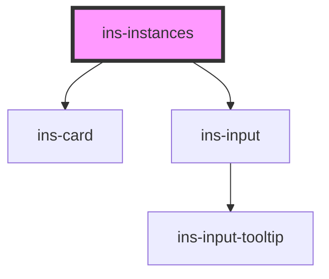

# ins-instances

<!-- Auto Generated Below -->

## Properties

| Property       | Attribute       | Description | Type      | Default     |
| -------------- | --------------- | ----------- | --------- | ----------- |
| `checkLoad`    | `check-load`    |             | `boolean` | `false`     |
| `hasLoad`      | `has-load`      |             | `string`  | `undefined` |
| `instance`     | `instance`      |             | `string`  | `""`        |
| `instanceLink` | `instance-link` |             | `string`  | `""`        |
| `load`         | `load`          |             | `boolean` | `false`     |
| `logoLink`     | `logo-link`     |             | `string`  | `""`        |
| `newTab`       | `new-tab`       |             | `boolean` | `false`     |

## Events

| Event     | Description | Type               |
| --------- | ----------- | ------------------ |
| `didLoad` |             | `CustomEvent<any>` |

## Dependencies

### Depends on

- [ins-card](../ins-card)
- [ins-input](../ins-input)

### Graph

----------------------------------------------

*Built with [StencilJS](https://stenciljs.com/)*
