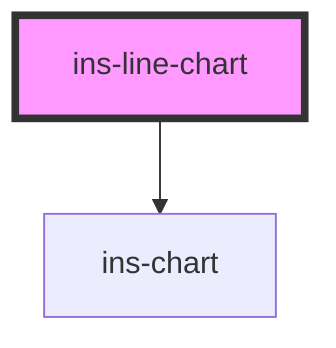

# ins-line-chart

<!-- Auto Generated Below -->

## Properties

| Property     | Attribute    | Description | Type      | Default     |
| ------------ | ------------ | ----------- | --------- | ----------- |
| `categories` | `categories` |             | `any`     | `[]`        |
| `chartData`  | `chart-data` |             | `any`     | `[]`        |
| `checkLoad`  | `check-load` |             | `boolean` | `false`     |
| `hasLoad`    | `has-load`   |             | `string`  | `undefined` |
| `load`       | `load`       |             | `boolean` | `false`     |
| `name`       | `name`       |             | `string`  | `""`        |

## Events

| Event     | Description | Type               |
| --------- | ----------- | ------------------ |
| `didLoad` |             | `CustomEvent<any>` |

## Dependencies

### Depends on

- [ins-chart](../ins-chart)

### Graph

----------------------------------------------

*Built with [StencilJS](https://stenciljs.com/)*
