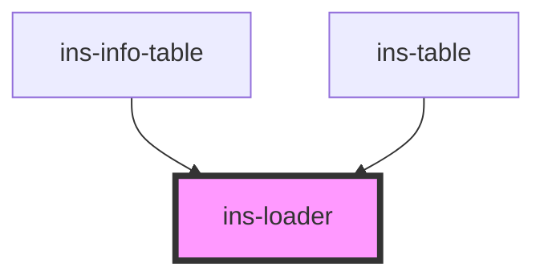

# ins-loader

<!-- Auto Generated Below -->

## Properties

| Property       | Attribute       | Description | Type      | Default                                                                                 |
| -------------- | --------------- | ----------- | --------- | --------------------------------------------------------------------------------------- |
| `iconColor`    | `icon-color`    |             | `string`  | `""`                                                                                    |
| `imageSource`  | `image-source`  |             | `string`  | `"https://ins-styleguide.s3-us-west-2.amazonaws.com/assets/images/loading-loop-2x.gif"` |
| `stateIcon`    | `state-icon`    |             | `string`  | `""`                                                                                    |
| `stateMessage` | `state-message` |             | `string`  | `""`                                                                                    |
| `stateTitle`   | `state-title`   |             | `string`  | `""`                                                                                    |
| `useImage`     | `use-image`     |             | `boolean` | `true`                                                                                  |

## Dependencies

### Used by

 - [ins-info-table](../ins-info-table)
 - [ins-table](../ins-table)

### Graph

----------------------------------------------

*Built with [StencilJS](https://stenciljs.com/)*
