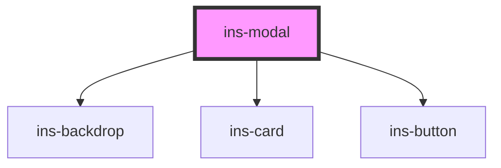

# ins-modal

<!-- Auto Generated Below -->

## Properties

| Property              | Attribute               | Description | Type      | Default     |
| --------------------- | ----------------------- | ----------- | --------- | ----------- |
| `buttonAlignment`     | `button-alignment`      |             | `string`  | `"center"`  |
| `checkLoad`           | `check-load`            |             | `boolean` | `false`     |
| `childModal`          | `child-modal`           |             | `any`     | `undefined` |
| `closeButtonColor`    | `close-button-color`    |             | `string`  | `undefined` |
| `closeButtonIcon`     | `close-button-icon`     |             | `string`  | `undefined` |
| `closeButtonLabel`    | `close-button-label`    |             | `string`  | `'CANCEL'`  |
| `confirmButtonColor`  | `confirm-button-color`  |             | `string`  | `undefined` |
| `confirmButtonIcon`   | `confirm-button-icon`   |             | `string`  | `undefined` |
| `confirmButtonLabel`  | `confirm-button-label`  |             | `string`  | `'OK'`      |
| `confirmation`        | `confirmation`          |             | `boolean` | `undefined` |
| `hasLoad`             | `has-load`              |             | `string`  | `undefined` |
| `heading`             | `heading`               |             | `string`  | `undefined` |
| `height`              | `height`                |             | `string`  | `"80%"`     |
| `light`               | `light`                 |             | `boolean` | `undefined` |
| `load`                | `load`                  |             | `boolean` | `false`     |
| `noButton`            | `no-button`             |             | `boolean` | `false`     |
| `parentRender`        | `parent-render`         |             | `string`  | `undefined` |
| `preventClickOutside` | `prevent-click-outside` |             | `boolean` | `false`     |
| `value`               | `value`                 |             | `any`     | `undefined` |
| `width`               | `width`                 |             | `string`  | `"80%"`     |
| `withBackdrop`        | `with-backdrop`         |             | `boolean` | `undefined` |

## Events

| Event      | Description | Type               |
| ---------- | ----------- | ------------------ |
| `didLoad`  |             | `CustomEvent<any>` |
| `insClose` |             | `CustomEvent<any>` |

## Methods

### `close() => Promise<void>`

#### Returns

Type: `Promise<void>`

### `open() => Promise<void>`

#### Returns

Type: `Promise<void>`

### `parentClosed(type: any) => Promise<void>`

#### Parameters

| Name   | Type  | Description |
| ------ | ----- | ----------- |
| `type` | `any` |             |

#### Returns

Type: `Promise<void>`

## Dependencies

### Depends on

- [ins-backdrop](../ins-backdrop)
- [ins-card](../ins-card)
- [ins-button](../ins-button)

### Graph

----------------------------------------------

*Built with [StencilJS](https://stenciljs.com/)*
