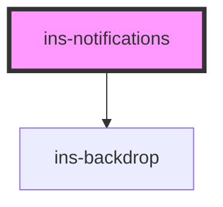

# ins-notifications

<!-- Auto Generated Below -->

## Methods

### `toggleNotificationshandler() => Promise<void>`

#### Returns

Type: `Promise<void>`

## Dependencies

### Depends on

- [ins-backdrop](../ins-backdrop)

### Graph

----------------------------------------------

*Built with [StencilJS](https://stenciljs.com/)*
