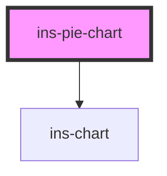

# ins-pie-chart

<!-- Auto Generated Below -->

## Properties

| Property      | Attribute      | Description | Type      | Default       |
| ------------- | -------------- | ----------- | --------- | ------------- |
| `chartData`   | --             |             | `any[]`   | `[]`          |
| `checkLoad`   | `check-load`   |             | `boolean` | `false`       |
| `colors`      | --             |             | `any[]`   | `undefined`   |
| `dataLabels`  | `data-labels`  |             | `boolean` | `true`        |
| `endAngle`    | `end-angle`    |             | `number`  | `undefined`   |
| `fillColor`   | `fill-color`   |             | `string`  | `'#E4E6EC'`   |
| `hasLoad`     | `has-load`     |             | `string`  | `undefined`   |
| `heading`     | `heading`      |             | `string`  | `"Pie Chart"` |
| `innerSize`   | `inner-size`   |             | `string`  | `undefined`   |
| `innerTitle`  | `inner-title`  |             | `boolean` | `false`       |
| `legends`     | `legends`      |             | `boolean` | `false`       |
| `load`        | `load`         |             | `boolean` | `false`       |
| `size`        | `size`         |             | `string`  | `undefined`   |
| `startAngle`  | `start-angle`  |             | `number`  | `undefined`   |
| `titleOffset` | `title-offset` |             | `number`  | `20`          |

## Events

| Event     | Description | Type               |
| --------- | ----------- | ------------------ |
| `didLoad` |             | `CustomEvent<any>` |

## Methods

### `reRenderChart(chartData: any) => Promise<void>`

#### Parameters

| Name        | Type  | Description |
| ----------- | ----- | ----------- |
| `chartData` | `any` |             |

#### Returns

Type: `Promise<void>`

## Dependencies

### Depends on

- [ins-chart](../ins-chart)

### Graph

----------------------------------------------

*Built with [StencilJS](https://stenciljs.com/)*
