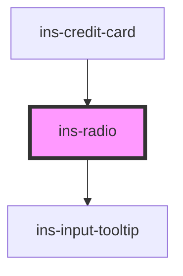

# ins-radio

<!-- Auto Generated Below -->

## Properties

| Property      | Attribute      | Description | Type      | Default     |
| ------------- | -------------- | ----------- | --------- | ----------- |
| `checked`     | `checked`      |             | `boolean` | `undefined` |
| `disabled`    | `disabled`     |             | `boolean` | `undefined` |
| `hasLoad`     | `has-load`     |             | `string`  | `undefined` |
| `label`       | `label`        |             | `any`     | `undefined` |
| `name`        | `name`         |             | `any`     | `undefined` |
| `staticValue` | `static-value` |             | `any`     | `undefined` |
| `tooltip`     | `tooltip`      |             | `string`  | `""`        |
| `value`       | `value`        |             | `any`     | `undefined` |

## Events

| Event            | Description | Type               |
| ---------------- | ----------- | ------------------ |
| `didLoad`        |             | `CustomEvent<any>` |
| `insCheck`       |             | `CustomEvent<any>` |
| `insValueChange` |             | `CustomEvent<any>` |

## Methods

### `getValue() => Promise<any>`

#### Returns

Type: `Promise<any>`

### `setChecked() => Promise<void>`

#### Returns

Type: `Promise<void>`

### `setValue(value: any, static_value: any) => Promise<void>`

#### Returns

Type: `Promise<void>`

## Dependencies

### Used by

 - [ins-credit-card](../ins-credit-card)

### Depends on

- [ins-input-tooltip](../ins-input-tooltip)

### Graph

----------------------------------------------

*Built with [StencilJS](https://stenciljs.com/)*
