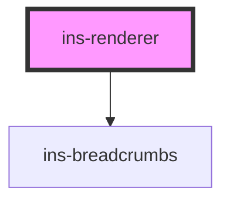

# ins-renderer

<!-- Auto Generated Below -->

## Properties

| Property  | Attribute  | Description | Type      | Default                         |
| --------- | ---------- | ----------- | --------- | ------------------------------- |
| `app`     | `app`      |             | `boolean` | `false`                         |
| `hasLoad` | `has-load` |             | `string`  | `undefined`                     |
| `label`   | `label`    |             | `string`  | `undefined`                     |
| `link`    | `link`     |             | `string`  | `undefined`                     |
| `route`   | `route`    |             | `any`     | `{     label: "", link: ""   }` |

## Events

| Event     | Description | Type               |
| --------- | ----------- | ------------------ |
| `didLoad` |             | `CustomEvent<any>` |

## Methods

### `pushHistory(title: any, childPage?: boolean) => Promise<void>`

#### Returns

Type: `Promise<void>`

### `resizeIframe() => Promise<void>`

#### Returns

Type: `Promise<void>`

### `updateRoute(newRoutes: any, noRedirect: boolean, iframe: any) => Promise<void>`

#### Returns

Type: `Promise<void>`

### `updateRouteLabel(value: any) => Promise<void>`

#### Returns

Type: `Promise<void>`

## Dependencies

### Depends on

- [ins-breadcrumbs](../ins-breadcrumbs)

### Graph

----------------------------------------------

*Built with [StencilJS](https://stenciljs.com/)*
