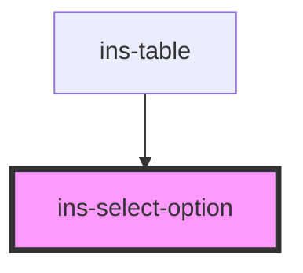

# ins-select-option

<!-- Auto Generated Below -->

## Properties

| Property   | Attribute  | Description | Type      | Default    |
| ---------- | ---------- | ----------- | --------- | ---------- |
| `default`  | `default`  |             | `boolean` | `false`    |
| `disabled` | `disabled` |             | `boolean` | `false`    |
| `label`    | `label`    |             | `string`  | `'Option'` |
| `value`    | `value`    |             | `string`  | `''`       |

## Events

| Event                    | Description | Type               |
| ------------------------ | ----------- | ------------------ |
| `insSelectOptionClicked` |             | `CustomEvent<any>` |

## Methods

### `activate() => Promise<void>`

#### Returns

Type: `Promise<void>`

### `deactivate() => Promise<void>`

#### Returns

Type: `Promise<void>`

### `hideOption() => Promise<void>`

#### Returns

Type: `Promise<void>`

### `showOption() => Promise<void>`

#### Returns

Type: `Promise<void>`

## Dependencies

### Used by

 - [ins-table](../ins-table)

### Graph

----------------------------------------------

*Built with [StencilJS](https://stenciljs.com/)*
