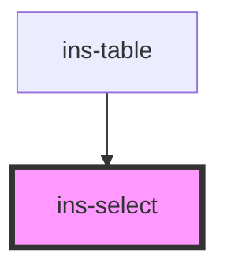

# ins-select

<!-- Auto Generated Below -->

## Properties

| Property                    | Attribute                      | Description | Type      | Default     |
| --------------------------- | ------------------------------ | ----------- | --------- | ----------- |
| `button`                    | `button`                       |             | `boolean` | `false`     |
| `buttonLabel`               | `button-label`                 |             | `string`  | `"Add"`     |
| `disabled`                  | `disabled`                     |             | `boolean` | `false`     |
| `dropUp`                    | `drop-up`                      |             | `boolean` | `false`     |
| `dynamicErrorMessage`       | `dynamic-error-message`        |             | `string`  | `""`        |
| `dynamicHasError`           | `dynamic-has-error`            |             | `boolean` | `false`     |
| `dynamicPlaceholder`        | `dynamic-placeholder`          |             | `string`  | `undefined` |
| `dynamicSearch`             | `dynamic-search`               |             | `boolean` | `false`     |
| `errorMessage`              | `error-message`                |             | `string`  | `""`        |
| `hasError`                  | `has-error`                    |             | `boolean` | `false`     |
| `hasLoad`                   | `has-load`                     |             | `string`  | `undefined` |
| `infiniteScroll`            | `infinite-scroll`              |             | `boolean` | `false`     |
| `initializing`              | `initializing`                 |             | `boolean` | `false`     |
| `label`                     | `label`                        |             | `string`  | `undefined` |
| `multiple`                  | `multiple`                     |             | `boolean` | `false`     |
| `name`                      | `name`                         |             | `string`  | `undefined` |
| `placeholder`               | `placeholder`                  |             | `string`  | `""`        |
| `readonly`                  | `readonly`                     |             | `boolean` | `false`     |
| `searchable`                | `searchable`                   |             | `boolean` | `false`     |
| `selected_values`           | `selected_values`              |             | `any`     | `[]`        |
| `small`                     | `small`                        |             | `boolean` | `false`     |
| `value`                     | `value`                        |             | `any`     | `undefined` |
| `withDynamicOption`         | `with-dynamic-option`          |             | `boolean` | `false`     |
| `withDynamicOptionValidate` | `with-dynamic-option-validate` |             | `boolean` | `false`     |

## Events

| Event             | Description | Type               |
| ----------------- | ----------- | ------------------ |
| `didLoad`         |             | `CustomEvent<any>` |
| `insClose`        |             | `CustomEvent<any>` |
| `insLoadMore`     |             | `CustomEvent<any>` |
| `insOptionSelect` |             | `CustomEvent<any>` |
| `insSearch`       |             | `CustomEvent<any>` |
| `insSubmit`       |             | `CustomEvent<any>` |
| `insValueChange`  |             | `CustomEvent<any>` |

## Methods

### `closeOptions() => Promise<void>`

#### Returns

Type: `Promise<void>`

### `collapseSection() => Promise<void>`

#### Returns

Type: `Promise<void>`

### `disableNoResult() => Promise<boolean>`

#### Returns

Type: `Promise<boolean>`

### `enableNoResult() => Promise<boolean>`

#### Returns

Type: `Promise<boolean>`

### `expandSection() => Promise<void>`

#### Returns

Type: `Promise<void>`

### `getAllOptions() => Promise<NodeListOf<HTMLInsSelectOptionElement>>`

#### Returns

Type: `Promise<NodeListOf<HTMLInsSelectOptionElement>>`

### `openOptions() => Promise<void>`

#### Returns

Type: `Promise<void>`

### `reset() => Promise<boolean>`

#### Returns

Type: `Promise<boolean>`

### `resetDynamicOption() => Promise<void>`

#### Returns

Type: `Promise<void>`

### `setInsSelectDefaultValue() => Promise<void>`

#### Returns

Type: `Promise<void>`

### `setLoadingState(state: any) => Promise<boolean>`

#### Returns

Type: `Promise<boolean>`

### `setSearchingState(state: any) => Promise<boolean>`

#### Returns

Type: `Promise<boolean>`

### `setSelectedFromValue(value?: any) => Promise<boolean>`

#### Returns

Type: `Promise<boolean>`

### `setValue(value: any) => Promise<void>`

#### Returns

Type: `Promise<void>`

### `toggleInsSelectOptions() => Promise<void>`

#### Returns

Type: `Promise<void>`

### `updateSelectedOptions() => Promise<boolean>`

#### Returns

Type: `Promise<boolean>`

## Dependencies

### Used by

 - [ins-table](../ins-table)

### Graph

----------------------------------------------

*Built with [StencilJS](https://stenciljs.com/)*
