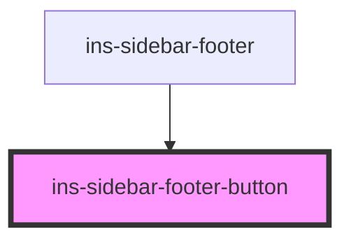

# ins-sidebar-footer-button

<!-- Auto Generated Below -->

## Properties

| Property | Attribute | Description | Type     | Default |
| -------- | --------- | ----------- | -------- | ------- |
| `icon`   | `icon`    |             | `string` | `''`    |
| `open`   | `open`    |             | `string` | `''`    |

## Events

| Event                         | Description | Type               |
| ----------------------------- | ----------- | ------------------ |
| `insSidebarFooterButtonEvent` |             | `CustomEvent<any>` |

## Methods

### `insSidebarFooterButtonOnClick(event: any) => Promise<void>`

#### Returns

Type: `Promise<void>`

## Dependencies

### Used by

 - [ins-sidebar-footer](../ins-sidebar-footer)

### Graph

----------------------------------------------

*Built with [StencilJS](https://stenciljs.com/)*
