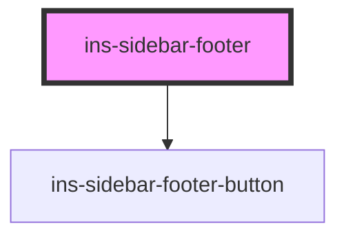

# ins-sidebar-footer

<!-- Auto Generated Below -->

## Properties

| Property    | Attribute    | Description | Type      | Default     |
| ----------- | ------------ | ----------- | --------- | ----------- |
| `checkLoad` | `check-load` |             | `boolean` | `false`     |
| `hasLoad`   | `has-load`   |             | `string`  | `undefined` |
| `load`      | `load`       |             | `boolean` | `false`     |

## Events

| Event     | Description | Type               |
| --------- | ----------- | ------------------ |
| `didLoad` |             | `CustomEvent<any>` |

## Methods

### `toggleSidebar() => Promise<void>`

#### Returns

Type: `Promise<void>`

## Dependencies

### Depends on

- [ins-sidebar-footer-button](../ins-sidebar-footer-button)

### Graph

----------------------------------------------

*Built with [StencilJS](https://stenciljs.com/)*
