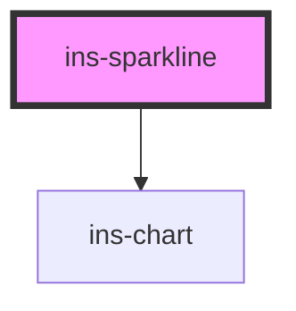

# ins-sparkline

<!-- Auto Generated Below -->

## Properties

| Property      | Attribute     | Description | Type     | Default     |
| ------------- | ------------- | ----------- | -------- | ----------- |
| `chartData`   | `chart-data`  |             | `any`    | `undefined` |
| `description` | `description` |             | `string` | `""`        |
| `icon`        | `icon`        |             | `string` | `""`        |
| `movement`    | `movement`    |             | `any`    | `""`        |
| `name`        | `name`        |             | `string` | `""`        |
| `percentage`  | `percentage`  |             | `any`    | `""`        |
| `value`       | `value`       |             | `string` | `""`        |

## Dependencies

### Depends on

- [ins-chart](../ins-chart)

### Graph

----------------------------------------------

*Built with [StencilJS](https://stenciljs.com/)*
