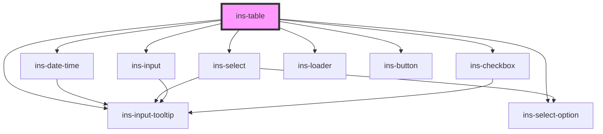

# ins-table

<!-- Auto Generated Below -->

## Properties

| Property                  | Attribute                    | Description | Type      | Default            |
| ------------------------- | ---------------------------- | ----------- | --------- | ------------------ |
| `bulkActions`             | `bulk-actions`               |             | `any`     | `[]`               |
| `checkLoad`               | `check-load`                 |             | `boolean` | `false`            |
| `currency`                | `currency`                   |             | `string`  | `""`               |
| `defaultBulkAction`       | `default-bulk-action`        |             | `string`  | `""`               |
| `emptyValue`              | `empty-value`                |             | `string`  | `"-"`              |
| `hasLoad`                 | `has-load`                   |             | `string`  | `undefined`        |
| `heading`                 | `heading`                    |             | `string`  | `""`               |
| `initialSearch`           | `initial-search`             |             | `string`  | `""`               |
| `isTotalCountEstimated`   | `is-total-count-estimated`   |             | `boolean` | `false`            |
| `load`                    | `load`                       |             | `boolean` | `false`            |
| `loaderIcon`              | `loader-icon`                |             | `any`     | `undefined`        |
| `loaderImageSource`       | `loader-image-source`        |             | `string`  | `null`             |
| `loaderMessage`           | `loader-message`             |             | `any`     | `undefined`        |
| `loaderTitle`             | `loader-title`               |             | `any`     | `undefined`        |
| `loadingScreen`           | `loading-screen`             |             | `boolean` | `false`            |
| `noWrap`                  | `no-wrap`                    |             | `boolean` | `false`            |
| `pageNumber`              | `page-number`                |             | `number`  | `1`                |
| `pageSize`                | `page-size`                  |             | `number`  | `10`               |
| `pageSizeOptions`         | `page-size-options`          |             | `any`     | `[10, 20, 50]`     |
| `paginationText`          | `pagination-text`            |             | `string`  | `"Rows per page:"` |
| `rowActions`              | `row-actions`                |             | `any`     | `[]`               |
| `rowActionsSettings`      | `row-actions-settings`       |             | `any`     | `undefined`        |
| `searchPosition`          | `search-position`            |             | `string`  | `"right"`          |
| `searchbarPlaceholder`    | `searchbar-placeholder`      |             | `string`  | `""`               |
| `selectedRows`            | `selected-rows`              |             | `any`     | `[]`               |
| `sortKeyword`             | `sort-keyword`               |             | `string`  | `""`               |
| `sortOrder`               | `sort-order`                 |             | `boolean` | `false`            |
| `staticTable`             | `static-table`               |             | `boolean` | `false`            |
| `tableData`               | `table-data`                 |             | `any`     | `[]`               |
| `tableHeaders`            | `table-headers`              |             | `any`     | `[]`               |
| `textOverflow`            | `text-overflow`              |             | `string`  | `""`               |
| `timezoneIcon`            | `timezone-icon`              |             | `string`  | `"icon-clock"`     |
| `totalCount`              | `total-count`                |             | `any`     | `0`                |
| `totalCountLoading`       | `total-count-loading`        |             | `boolean` | `false`            |
| `totalCountLoadingFailed` | `total-count-loading-failed` |             | `boolean` | `false`            |
| `updatedRows`             | `updated-rows`               |             | `any`     | `[]`               |
| `withoutPagination`       | `without-pagination`         |             | `boolean` | `false`            |
| `withoutSearch`           | `without-search`             |             | `boolean` | `false`            |

## Events

| Event                 | Description | Type               |
| --------------------- | ----------- | ------------------ |
| `didLoad`             |             | `CustomEvent<any>` |
| `insFieldChange`      |             | `CustomEvent<any>` |
| `insPaginationChange` |             | `CustomEvent<any>` |
| `insTableBulkAction`  |             | `CustomEvent<any>` |
| `insTableRowAction`   |             | `CustomEvent<any>` |
| `insTableSearch`      |             | `CustomEvent<any>` |
| `insTableSort`        |             | `CustomEvent<any>` |

## Methods

### `resetSelections() => Promise<void>`

#### Returns

Type: `Promise<void>`

### `setBulkAction(value: any) => Promise<void>`

#### Parameters

| Name    | Type  | Description |
| ------- | ----- | ----------- |
| `value` | `any` |             |

#### Returns

Type: `Promise<void>`

### `updatePageInfo() => Promise<void>`

#### Returns

Type: `Promise<void>`

## Dependencies

### Depends on

- [ins-date-time](../ins-date-time)
- [ins-select](../ins-select)
- [ins-select-option](../ins-select-option)
- [ins-input](../ins-input)
- [ins-input-tooltip](../ins-input-tooltip)
- [ins-checkbox](../ins-checkbox)
- [ins-loader](../ins-loader)
- [ins-button](../ins-button)

### Graph

----------------------------------------------

*Built with [StencilJS](https://stenciljs.com/)*
