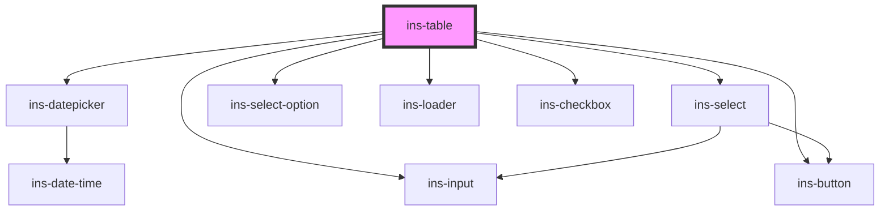

# ins-table

<!-- Auto Generated Below -->

## Properties

| Property               | Attribute               | Description | Type      | Default            |
| ---------------------- | ----------------------- | ----------- | --------- | ------------------ |
| `bulkActions`          | `bulk-actions`          |             | `any`     | `[]`               |
| `currency`             | `currency`              |             | `string`  | `''`               |
| `defaultBulkAction`    | `default-bulk-action`   |             | `string`  | `''`               |
| `emptyValue`           | `empty-value`           |             | `string`  | `'-'`              |
| `heading`              | `heading`               |             | `string`  | `''`               |
| `initialSearch`        | `initial-search`        |             | `string`  | `''`               |
| `loaderIcon`           | `loader-icon`           |             | `any`     | `undefined`        |
| `loaderMessage`        | `loader-message`        |             | `any`     | `undefined`        |
| `loaderTitle`          | `loader-title`          |             | `any`     | `undefined`        |
| `loadingScreen`        | `loading-screen`        |             | `boolean` | `false`            |
| `noWrap`               | `no-wrap`               |             | `boolean` | `false`            |
| `pageNumber`           | `page-number`           |             | `number`  | `1`                |
| `pageSize`             | `page-size`             |             | `number`  | `10`               |
| `pageSizeOptions`      | `page-size-options`     |             | `any`     | `[10, 20, 50]`     |
| `paginationText`       | `pagination-text`       |             | `string`  | `'Rows per page:'` |
| `rowActions`           | `row-actions`           |             | `any`     | `[]`               |
| `searchPosition`       | `search-position`       |             | `string`  | `"right"`          |
| `searchbarPlaceholder` | `searchbar-placeholder` |             | `string`  | `''`               |
| `selectedRows`         | `selected-rows`         |             | `any`     | `[]`               |
| `sortKeyword`          | `sort-keyword`          |             | `string`  | `''`               |
| `sortOrder`            | `sort-order`            |             | `boolean` | `false`            |
| `staticTable`          | `static-table`          |             | `boolean` | `false`            |
| `tableData`            | `table-data`            |             | `any`     | `[]`               |
| `tableHeaders`         | `table-headers`         |             | `any`     | `[]`               |
| `textOverflow`         | `text-overflow`         |             | `string`  | `''`               |
| `totalCount`           | `total-count`           |             | `any`     | `0`                |
| `updatedRows`          | `updated-rows`          |             | `any`     | `[]`               |
| `withoutPagination`    | `without-pagination`    |             | `boolean` | `false`            |
| `withoutSearch`        | `without-search`        |             | `boolean` | `false`            |

## Events

| Event                 | Description | Type               |
| --------------------- | ----------- | ------------------ |
| `insFieldChange`      |             | `CustomEvent<any>` |
| `insPaginationChange` |             | `CustomEvent<any>` |
| `insTableBulkAction`  |             | `CustomEvent<any>` |
| `insTableRowAction`   |             | `CustomEvent<any>` |
| `insTableSearch`      |             | `CustomEvent<any>` |
| `insTableSort`        |             | `CustomEvent<any>` |

## Methods

### `resetSelections() => Promise<void>`

#### Returns

Type: `Promise<void>`

### `setBulkAction(value: any) => Promise<void>`

#### Returns

Type: `Promise<void>`

### `updatePageInfo() => Promise<void>`

#### Returns

Type: `Promise<void>`

## Dependencies

### Depends on

- [ins-datepicker](../ins-datepicker)
- [ins-select](../ins-select)
- [ins-select-option](../ins-select-option)
- [ins-input](../ins-input)
- [ins-loader](../ins-loader)
- [ins-checkbox](../ins-checkbox)
- [ins-button](../ins-button)

### Graph

----------------------------------------------

*Built with [StencilJS](https://stenciljs.com/)*
