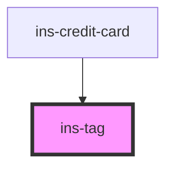

# ins-tag

<!-- Auto Generated Below -->

## Properties

| Property          | Attribute          | Description | Type      | Default     |
| ----------------- | ------------------ | ----------- | --------- | ----------- |
| `backgroundColor` | `background-color` |             | `string`  | `undefined` |
| `color`           | `color`            |             | `string`  | `undefined` |
| `fontColor`       | `font-color`       |             | `string`  | `undefined` |
| `fontInherit`     | `font-inherit`     |             | `boolean` | `false`     |
| `icon`            | `icon`             |             | `string`  | `undefined` |
| `label`           | `label`            |             | `string`  | `undefined` |
| `light`           | `light`            |             | `boolean` | `true`      |
| `outlineColor`    | `outline-color`    |             | `string`  | `undefined` |
| `outlined`        | `outlined`         |             | `boolean` | `false`     |

## Dependencies

### Used by

 - [ins-credit-card](../ins-credit-card)

### Graph

----------------------------------------------

*Built with [StencilJS](https://stenciljs.com/)*
