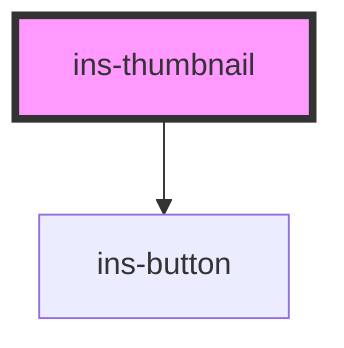

# ins-thumbnail

<!-- Auto Generated Below -->

## Properties

| Property      | Attribute      | Description | Type     | Default      |
| ------------- | -------------- | ----------- | -------- | ------------ |
| `alt`         | `alt`          |             | `string` | `undefined`  |
| `buttonColor` | `button-color` |             | `string` | `"blue"`     |
| `buttonIcon`  | `button-icon`  |             | `string` | `""`         |
| `buttonLabel` | `button-label` |             | `string` | `"DOWNLOAD"` |
| `buttonType`  | `button-type`  |             | `string` | `""`         |
| `hasLoad`     | `has-load`     |             | `string` | `undefined`  |
| `label`       | `label`        |             | `string` | `undefined`  |
| `name`        | `name`         |             | `string` | `undefined`  |
| `src`         | `src`          |             | `string` | `undefined`  |
| `thumbnail`   | `thumbnail`    |             | `string` | `undefined`  |

## Events

| Event     | Description | Type               |
| --------- | ----------- | ------------------ |
| `didLoad` |             | `CustomEvent<any>` |

## Dependencies

### Depends on

- [ins-button](../ins-button)

### Graph

----------------------------------------------

*Built with [StencilJS](https://stenciljs.com/)*
