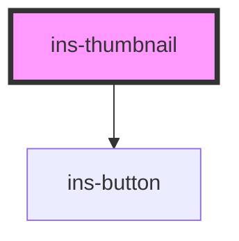

# ins-thumbnail

<!-- Auto Generated Below -->

## Properties

| Property    | Attribute   | Description | Type     | Default     |
| ----------- | ----------- | ----------- | -------- | ----------- |
| `alt`       | `alt`       |             | `string` | `undefined` |
| `label`     | `label`     |             | `string` | `undefined` |
| `name`      | `name`      |             | `string` | `undefined` |
| `src`       | `src`       |             | `string` | `undefined` |
| `thumbnail` | `thumbnail` |             | `string` | `undefined` |

## Dependencies

### Depends on

- [ins-button](../ins-button)

### Graph

----------------------------------------------

*Built with [StencilJS](https://stenciljs.com/)*
