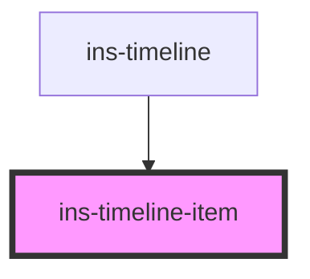

# ins-timeline-item

<!-- Auto Generated Below -->

## Properties

| Property   | Attribute  | Description | Type      | Default     |
| ---------- | ---------- | ----------- | --------- | ----------- |
| `color`    | `color`    |             | `string`  | `undefined` |
| `datetime` | `datetime` |             | `string`  | `undefined` |
| `heading`  | `heading`  |             | `string`  | `undefined` |
| `icon`     | `icon`     |             | `string`  | `undefined` |
| `inline`   | `inline`   |             | `boolean` | `true`      |
| `solid`    | `solid`    |             | `boolean` | `false`     |

## Dependencies

### Used by

 - [ins-timeline](../ins-timeline)

### Graph

----------------------------------------------

*Built with [StencilJS](https://stenciljs.com/)*
