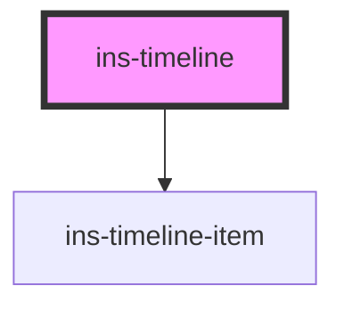

# ins-timeline

<!-- Auto Generated Below -->

## Properties

| Property         | Attribute         | Description | Type      | Default     |
| ---------------- | ----------------- | ----------- | --------- | ----------- |
| `label`          | `label`           |             | `string`  | `undefined` |
| `loadingScreen`  | `loading-screen`  |             | `boolean` | `false`     |
| `staticTimeline` | `static-timeline` |             | `boolean` | `false`     |
| `timelineData`   | `timeline-data`   |             | `any`     | `[]`        |

## Dependencies

### Depends on

- [ins-timeline-item](../ins-timeline-item)

### Graph

----------------------------------------------

*Built with [StencilJS](https://stenciljs.com/)*
