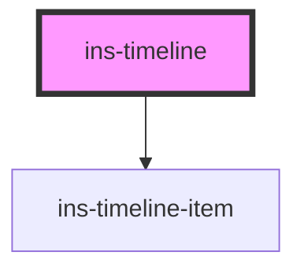

# ins-timeline

<!-- Auto Generated Below -->

## Properties

| Property         | Attribute         | Description | Type      | Default     |
| ---------------- | ----------------- | ----------- | --------- | ----------- |
| `checkLoad`      | `check-load`      |             | `boolean` | `false`     |
| `hasLoad`        | `has-load`        |             | `string`  | `undefined` |
| `label`          | `label`           |             | `string`  | `undefined` |
| `load`           | `load`            |             | `boolean` | `false`     |
| `loadingScreen`  | `loading-screen`  |             | `boolean` | `false`     |
| `staticTimeline` | `static-timeline` |             | `boolean` | `false`     |
| `timelineData`   | `timeline-data`   |             | `any`     | `[]`        |

## Events

| Event     | Description | Type               |
| --------- | ----------- | ------------------ |
| `didLoad` |             | `CustomEvent<any>` |

## Dependencies

### Depends on

- [ins-timeline-item](../ins-timeline-item)

### Graph

----------------------------------------------

*Built with [StencilJS](https://stenciljs.com/)*
