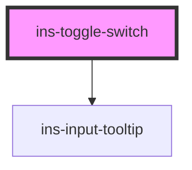

# ins-toggle-switch

<!-- Auto Generated Below -->

## Properties

| Property        | Attribute        | Description | Type      | Default     |
| --------------- | ---------------- | ----------- | --------- | ----------- |
| `checked`       | `checked`        |             | `boolean` | `undefined` |
| `disabled`      | `disabled`       |             | `boolean` | `undefined` |
| `disabledLabel` | `disabled-label` |             | `string`  | `undefined` |
| `enabledLabel`  | `enabled-label`  |             | `string`  | `undefined` |
| `falseValue`    | `false-value`    |             | `string`  | `""`        |
| `hasLoad`       | `has-load`       |             | `string`  | `undefined` |
| `label`         | `label`          |             | `string`  | `undefined` |
| `name`          | `name`           |             | `string`  | `undefined` |
| `tooltip`       | `tooltip`        |             | `string`  | `""`        |
| `trueValue`     | `true-value`     |             | `string`  | `""`        |
| `value`         | `value`          |             | `string`  | `undefined` |

## Events

| Event            | Description | Type               |
| ---------------- | ----------- | ------------------ |
| `didLoad`        |             | `CustomEvent<any>` |
| `insToggle`      |             | `CustomEvent<any>` |
| `insValueChange` |             | `CustomEvent<any>` |

## Methods

### `getValue() => Promise<{ value: string; trueValue: string; falseValue: string; }>`

#### Returns

Type: `Promise<{ value: string; trueValue: string; falseValue: string; }>`

### `setValue(value: any, trueValue: any, falseValue: any) => Promise<void>`

#### Parameters

| Name         | Type  | Description |
| ------------ | ----- | ----------- |
| `value`      | `any` |             |
| `trueValue`  | `any` |             |
| `falseValue` | `any` |             |

#### Returns

Type: `Promise<void>`

### `updateCheckState(state: any) => Promise<void>`

#### Parameters

| Name    | Type  | Description |
| ------- | ----- | ----------- |
| `state` | `any` |             |

#### Returns

Type: `Promise<void>`

## Dependencies

### Depends on

- [ins-input-tooltip](../ins-input-tooltip)

### Graph

----------------------------------------------

*Built with [StencilJS](https://stenciljs.com/)*
